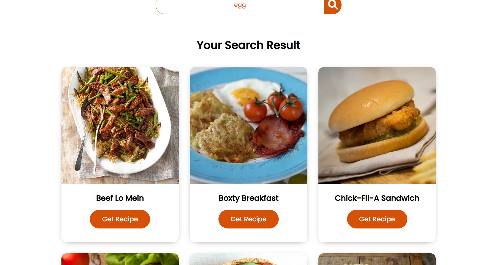

<h1>Food Recipe App using API</h1>

<h4>This is a web app where you can get food recipe from your searched ingredients</h4>
<h4>This is a pure vanilla javascript project based on this <a href="https://www.youtube.com/watch?v=opikz5x_1ak">video tutorial </a></h4>

<li>Usage</li>

<li>
<h4>The landing page looks like this</h4>
</li>

<li>
<h4>Enter your ingredients in the search bar</h4>
</li>

<li>
<h4>This is how all the food item will be listed</h4>
</li>

<li>
<h4>Click on Get Recipe button</h4>
</li>

<li>
<h4>The recipes</h4>
</li>

